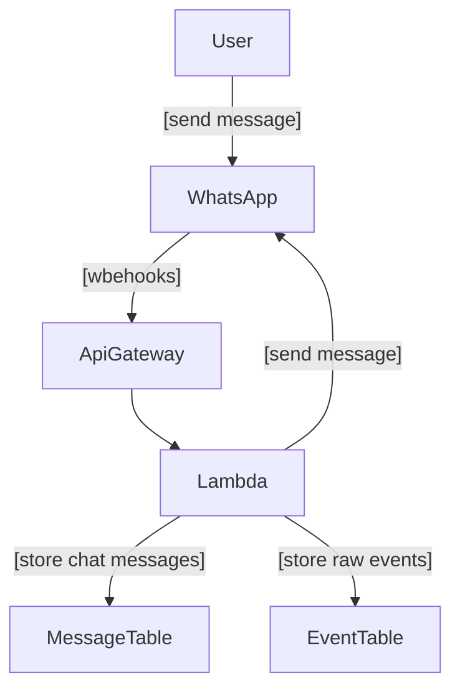
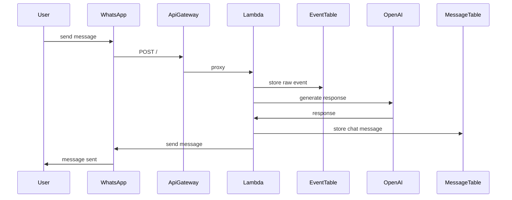

# WhatsApp Bot

Simple WhatsApp bot infrastructure on AWS Lambda using CDK.

## Setup

```bash
uv sync
```

To start developing locally:

```bash
docker compose up
```

Create the tables:

- `EVENTS_TABLE`
- `MESSAGES_TABLE`

```bash
make tables
```

Create the RAG bucket:

```bash
make bucket
```

Run the app:

```bash
uv run uvicorn handler:app --reload
```

### Docker


If you don't want to read:

```bash
docker compose up --build
```

## Deployment

Deploy:

```bash
npx aws-cdk deploy --app 'uv run infra.py' --verbose
# or
make deploy
```

Destroy:

```bash
npx aws-cdk destroy --app 'uv run infra.py' --verbose
# or
make destroy
```

Redeploy:

```bash
npx aws-cdk destroy --app 'uv run infra.py' --verbose
# or
make reset
```

## Infrastructure

### Architecture Diagram

Architecture diagram of the infrastructure:



Sequence diagram of the message flow:


