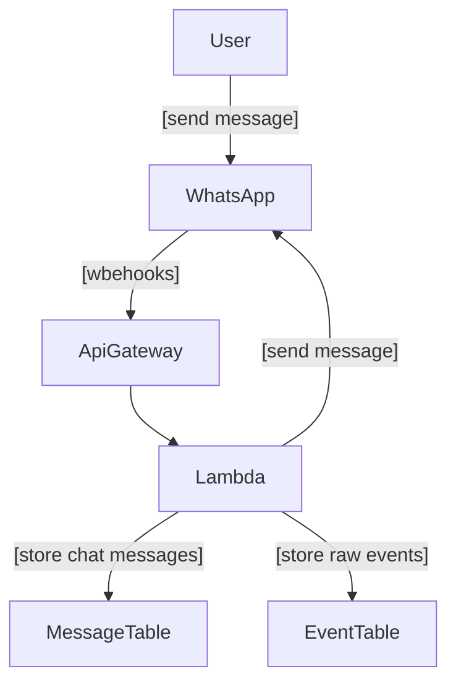
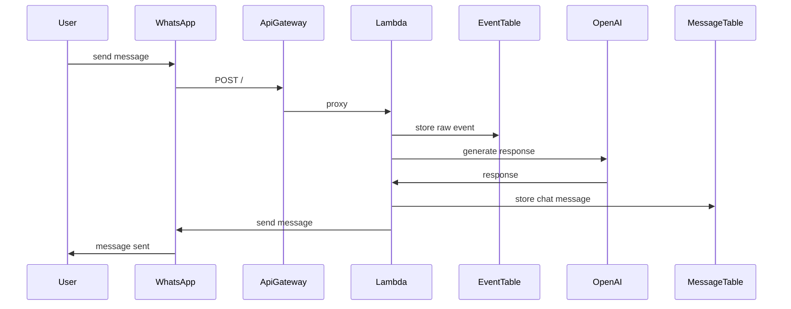

# WhatsApp Bot

Simple WhatsApp bot infrastructure on AWS Lambda using CDK.

## Setup

```bash
uv venv
source .venv/bin/activate
uv sync
```

To start developing locally:

```bash
docker compose up
```

Create the events table:

```bash
aws dynamodb create-table \
    --table-name 'EVENTS_TABLE' \
    --attribute-definitions \
        AttributeName=id,AttributeType=S \
        AttributeName=key,AttributeType=S \
    --key-schema \
        AttributeName=id,KeyType=HASH \
        AttributeName=key,KeyType=RANGE \
    --provisioned-throughput \
        ReadCapacityUnits=1,WriteCapacityUnits=1 \
    --endpoint-url 'http://localhost:8001'
```

Create the messages table:

```bash
aws dynamodb create-table \
    --table-name 'MESSAGES_TABLE' \
    --attribute-definitions \
        AttributeName=from_,AttributeType=S \
        AttributeName=timestamp,AttributeType=S \
    --key-schema \
        AttributeName=from_,KeyType=HASH \
        AttributeName=timestamp,KeyType=RANGE \
    --provisioned-throughput \
        ReadCapacityUnits=1,WriteCapacityUnits=1 \
    --endpoint-url 'http://localhost:8001'
```

Run the app:

```bash
uv run run.py
```

### Docker

```bash
docker compose up --build
```

## Deployment

Deploy:

```bash
npx aws-cdk deploy --app 'uv run infra.py' --verbose
```

Destroy:

```bash
npx aws-cdk destroy --app 'uv run infra.py' --verbose
```

## Infrastructure

### Architecture Diagram

Architecture diagram of the infrastructure:



Sequence diagram of the message flow:


